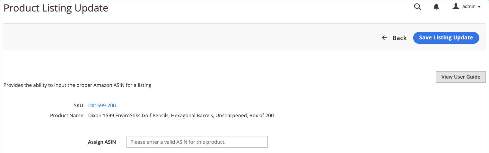

# Actualizar la información necesaria (anuncio incompleto)

Anuncios mostrados en la _[!UICONTROL Incomplete]_pestaña incluir su [!DNL Commerce] los productos del catálogo que cumplan los requisitos de idoneidad para Amazon definidos en las reglas del anuncio, pero que no tengan la información requerida por Amazon antes de ponerlos en venta.

## Actualizar la información necesaria (no se puede asignar a un anuncio de Amazon) {#update-required-info-unable-to-assign-to-amazon-listing}

1. Ver los anuncios de la _[!UICONTROL Incomplete]_pestaña en [Administrar anuncios](./managing-product-listings.md).

1. En el _[!UICONTROL Action]_, haga clic en **[!UICONTROL Select]**>**[!UICONTROL Update Required Info]**para el anuncio que deseas actualizar.

1. Revise la información de producto del catálogo (SKU y nombre del producto) que quiere relacionar con un anuncio de Amazon.

1. Para **[!UICONTROL Assign ASIN]**, introduzca el ASIN asignado por Amazon para el listado que desea asociar al producto del catálogo.

1. Para guardar la coincidencia del producto, haga clic en **[!UICONTROL Save Listing Update]**.

El anuncio ahora coincide con el catálogo y, a continuación, se actualiza y publica en Amazon en función de la configuración de cron y del anuncio. También se elimina del _[!UICONTROL Incomplete]_pestaña.

{width="600" zoomable="yes"}

## Actualizar la información necesaria (se encontraron varias coincidencias) {#update-required-info-multiple-matches-found}

1. Ver los anuncios de la _[!UICONTROL Incomplete]_pestaña en [[!UICONTROL Manage Listings]](./managing-product-listings.md).

1. En el _Acción_ , haga clic en **Seleccionar** > **Actualizar información requerida** para el anuncio que deseas actualizar.

1. Revise la información de producto del catálogo (SKU y nombre del producto) que quiere relacionar con un anuncio de Amazon.

1. Para **[!UICONTROL Select Correct Amazon Listing]**, elija el ASIN correcto para el listado que desea que coincida con este producto.

   Las opciones enumeradas aquí incluyen productos de catálogo que se identifican como posibles coincidencias. Si ninguna de las opciones es correcta, puede elegir `Manually Enter Correct ASIN` e introduzca manualmente el ASIN del producto.

1. Si introduce el ASIN manualmente, introduzca el ASIN correcto para **[!UICONTROL Manually Assign ASIN]**.

1. Para guardar la coincidencia del producto, haga clic en **[!UICONTROL Save Listing Update]**.

{width="600" zoomable="yes"}

## Actualizar la información necesaria (tiene variantes) {#update-required-info-has-variants}

1. Ver los anuncios de la _[!UICONTROL Incomplete]_pestaña en [[!UICONTROL Manage Listings]](./managing-product-listings.md).

1. En el _[!UICONTROL Action]_, haga clic en **[!UICONTROL Select]**>**[!UICONTROL Update Required Info]**para el anuncio que deseas actualizar.

1. Revise la información de producto del catálogo (SKU y nombre del producto) que quiere relacionar con un anuncio de Amazon.

1. Para **[!UICONTROL Select Correct Amazon Listing]**, elija el ASIN correcto para el listado que desea que coincida con este producto.

   Las opciones enumeradas aquí incluyen productos de catálogo que se identifican como posibles coincidencias. Si ninguna de las opciones es correcta, puede seleccionar `Manually Enter Correct ASIN` e introduzca manualmente el ASIN del producto.

1. Si introduce el ASIN manualmente, introduzca el ASIN correcto para **[!UICONTROL Manually Assign ASIN]**.

1. Para guardar la coincidencia del producto, haga clic en **[!UICONTROL Save Listing Update]**.

## Actualizar la información necesaria (falta la condición) {#update-required-info-missing-condition}

1. Ver los anuncios de la _[!UICONTROL Incomplete]_pestaña en [Administrar anuncios](./managing-product-listings.md).

1. En el _[!UICONTROL Action]_, haga clic en **[!UICONTROL Select]**>**[!UICONTROL Update Required Info]**para el anuncio que deseas actualizar.

1. Revise la información de producto del catálogo (SKU y nombre del producto) que quiere relacionar con un anuncio de Amazon.

1. Para **[!UICONTROL Condition]**, elija la condición adecuada.

   La lista de opciones disponibles depende de su [Condición de lista de productos](./product-listing-condition.md) configuración.

1. Para guardar la coincidencia del producto, haga clic en **[!UICONTROL Save Listing Update]** .

{width="600" zoomable="yes"}
