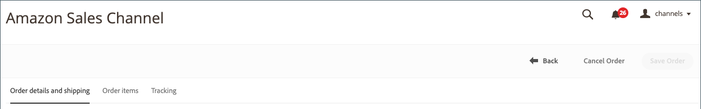

# Detalles del pedido de Amazon

{width="600" zoomable="yes"}

## Ver detalles del pedido de Amazon

1. Clic **[!UICONTROL View Store]** en la tarjeta de la tienda.

1. En el _[!UICONTROL Recent Orders]_, haga clic en un número de pedido.

   El _[!UICONTROL Amazon Order Details]_se abre la página.

>[!NOTE]
>
>Si tiene habilitada la importación de pedidos en su [Configuración de pedidos](./order-settings.md) y el pedido es [completado por Amazon (FBA)](./fulfilled-by.md)Sin embargo, puede ver datos ficticios para algunos campos en los detalles del pedido. Amazon no envía los siguientes datos para pedidos de FBA.
>
> - `AddressType`
> - `AddressLine1`
> - `AddressLine2`
> - `AddressLine3`
> - `BuyerName`
> - `Phone`
> - `PurchaseOrderNumber`
> - `RecipientName`
> - `CustomizedURL`
> - `GiftMessageText`

### Pestaña Detalles del pedido y el envío

El _[!UICONTROL Order and Shipping Details]_La pestaña muestra información detallada del pedido, tal como se recibe de Amazon.

>[!IMPORTANT]
>
>Amazon acepta información de direcciones no estándar que no se puede importar al canal de ventas de Amazon, lo que impide que los códigos de estado/país se actualicen correctamente en algunos pedidos. Para corregir errores de dirección, los siguientes campos pueden editarse en los detalles del pedido:
>
>- `Shipping address 1`
>- `Shipping address 2`
>- `Shipping address 3`
>- `Shipping city`
>- `Shipping region`
>- `Shipping postal code`
>- `Shipping country`
>
>No olvide hacer clic en **Guardar pedido** después de realizar modificaciones.

{width="600" zoomable="yes"}

### Pestaña Ordenar elementos

El _[!UICONTROL Order Items]_La pestaña muestra todos los elementos asociados con el pedido de Amazon, tal como se recibieron de Amazon.

{width="600" zoomable="yes"}

### Pestaña Seguimiento

El _[!UICONTROL Tracking]_La pestaña muestra información de seguimiento asociada con el pedido de Amazon.

{width="600" zoomable="yes"}
