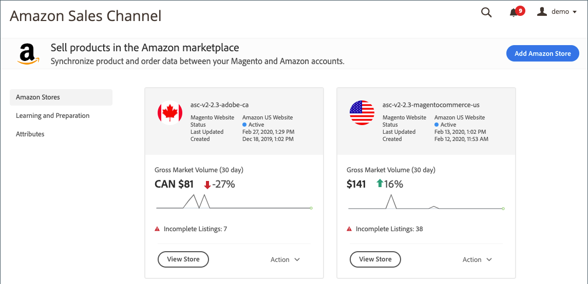

# página de inicio del canal de ventas de Amazon

La página de inicio del canal de ventas de Amazon es su página de aterrizaje al acceder a su canal de ventas de Amazon.

Las vistas disponibles en el menú de la izquierda incluyen:

- [[!UICONTROL Amazon Stores]](./managing-stores.md) - (Vista predeterminada) Consulta la información de resumen de cada una de las tiendas de canales de ventas de Amazon. Para ver la tienda [tablero](./amazon-store-dashboard.md), haga clic en **[!UICONTROL View Store]**.
- [[!UICONTROL Learning and Preparation]](./learning-preparation.md) - Ver su Amazon y [!DNL Commerce] tareas de configuración recomendadas y materiales de aprendizaje disponibles.
- [[!UICONTROL Attributes]](./managing-attributes.md) - Ver y administrar vínculos [!DNL Commerce] y atributos de Amazon para su catálogo de productos. Para sincronizarse automáticamente con Amazon, edite o cree y vincule atributos directamente a través de [!DNL Commerce].

## Acceso al canal de ventas de Amazon

En el _[!UICONTROL Admin]_barra lateral, vaya a **[!UICONTROL Marketing]**>_[!UICONTROL Channels]_ > **[!UICONTROL Amazon Sales Channel]**.

Se abre la página de inicio del canal de ventas de Amazon, con el valor predeterminado [_Tiendas Amazon_](./managing-stores.md) vista.
