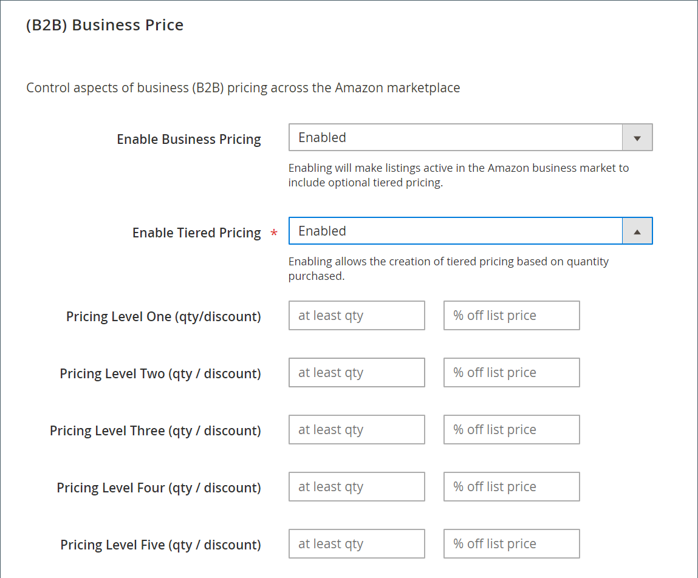

# [!DNL (B2B) Business Price] para anuncios de Amazon

(B2B) La configuración del precio comercial forma parte de la configuración del anuncio de la tienda. Se accede a la configuración de anuncio desde el [Tablero de la tienda Amazon](./amazon-store-dashboard.md).

[!DNL Amazon Business] es un mercado exclusivo de las cuentas comerciales registradas de Amazon que solo está disponible en Estados Unidos, Francia, Alemania y Reino Unido. Si el mercado permite los precios comerciales B2B, se pueden editar en la configuración del anuncio.

[!DNL B2B Business Pricing] permite que los comerciantes con cuentas empresariales puedan realizar compras entre sí con el rendimiento esperado de la experiencia de compra de Amazon. Con los precios empresariales B2B, las empresas pueden ofrecer precios escalonados en función de la cantidad comprada.

Para que sus productos aparezcan en la lista de [!DNL Amazon Business (B2B)] sitio, primero debe habilitar la empresa en su [!DNL Amazon Seller Central] cuenta. Para obtener más información sobre la función B2B, consulte [Amazon: B2B Central](https://sellercentral.amazon.com/gp/help/G202161480/){target="_blank"} (requiere el inicio de sesión en la Central de vendedores).

## Configurar [!DNL (B2B) Business Price] configuración

1. Clic **[!UICONTROL Listing Settings]** en el tablero de la tienda.

1. Expanda el _[!UICONTROL (B2B) Business Price]_sección.

1. Para **[!UICONTROL Enable Business Pricing]**, elija una opción.

   - `Disabled` - (Predeterminado) Elija cuándo no desea habilitar las ventas de empresa a empresa. El resto de campos de esta sección se desactivan al elegirlos.

   - `Enabled` - Elija cuándo desea activar sus ventas de empresa a empresa. Cuando se habilita, el precio comercial se establece igual al precio de lista después de aplicar todas las reglas de precios. El precio comercial sigue el ámbito de precios del sitio web, si está habilitado. El precio de una empresa no puede ser inferior a 1 dólar.

1. Para **[!UICONTROL Enable Tiered Pricing]**, elija una opción.

   - `Disabled` - (Predeterminado) Seleccione cuándo desea que el precio de listado sea el mismo para todas las cantidades de pedidos. Cuando se elige, todas _[!UICONTROL Pricing Level]_Los campos de esta sección están desactivados.

   - `Enabled` - Seleccione cuándo desea activar los ajustes de precios basados en la cantidad del pedido. Cuando se elige, la variable _[!UICONTROL Pricing Level]_Los campos están activados.

1. Complete la **[!UICONTROL Pricing Level]** configuración.

   Puedes definir hasta cinco opciones de cantidad/descuento que establecen los precios de nivel para tus anuncios de empresa. En cada fila, introduzca el valor de umbral de cantidad y el porcentaje de descuento que desea aplicar. Por ejemplo, si introduce `5` en el primer campo de la primera fila y `5` en el segundo campo, el precio aplica un descuento del 5% cuando otra empresa compra una cantidad de 5 o más.

1. Cuando termine, haga clic en **[!UICONTROL Save listing settings]**.

{width="500" zoomable="yes"}

| Campo | Descripción |
|----------------------------------------------------|------------------------------------------------------------------------------------------------------------------------------------------------------------------------------------------------------------------------------------------------------------------------------------------------------------------------------------------------------------------------------------------------------------------------------------------------------------------------------------------------------------------------|
| [!UICONTROL Enable Business Pricing] | Opciones: <ul><li>**[!UICONTROL Disabled]** - (Predeterminado) Elija cuándo no desea habilitar las ventas de empresa a empresa. Cuando se elige, todos los demás campos de esta sección se desactivan.</li><li>**[!UICONTROL Enabled]** - Elija cuándo desea habilitar su negocio para las ventas del negocio. Cuando se elige, el precio comercial se establece igual al precio de lista después de aplicar todas las reglas de asignación de precios. El precio comercial sigue el ámbito de precios del sitio web, si está habilitado. El precio de una empresa no puede ser inferior a 1 dólar.</li></ul> |
| [!UICONTROL Enable Tiered Pricing] | (Obligatorio) Opciones: <ul><li>**[!UICONTROL Disabled]** - (Predeterminado) Seleccione cuándo desea que el precio de listado sea el mismo para todas las cantidades de pedidos. Cuando se elige, todas _[!UICONTROL Pricing Level]_Los campos de esta sección están desactivados.</li><li>**[!UICONTROL Enabled]** - Seleccione cuándo desea activar precios que se ajusten según la cantidad del pedido. Cuando se elige, la variable _[!UICONTROL Pricing Level]_Los campos están activados.</li></ul> |
| [!UICONTROL Pricing Level One-Five (qty/discount)] | Cuando se activa la opción Asignación de Precios por Niveles, puedes definir hasta cinco opciones de cantidad/descuento que establecen los precios por niveles para tus anuncios de empresa. En cada fila, introduzca el valor de umbral de cantidad y el porcentaje de descuento que desea aplicar. Por ejemplo, si introduce `5` en el primer campo de la primera fila y `5` en el segundo campo, el precio aplica un descuento del 5% cuando otra empresa compra una cantidad de cinco o más. |

**Acceso rápido** - [!UICONTROL Listing Settings] secciones

- [[!UICONTROL Product Listing Actions]](./product-listing-actions.md)
- [[!UICONTROL Third Party Listings]](./third-party-listing-settings.md)
- [[!UICONTROL Listing Price]](./listing-price.md)
- [[!UICONTROL (B2B) Business Price]](./business-pricing.md)
- [[!UICONTROL Stock / Quantity]](./stock-quantity.md)
- [[!UICONTROL Fulfilled By]](./fulfilled-by.md)
- [[!UICONTROL Catalog Search]](./catalog-search.md)
- [[!UICONTROL Product Listing Condition]](./product-listing-condition.md)
