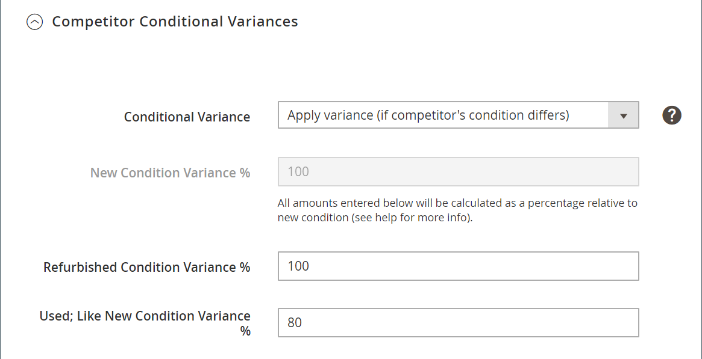

# Regla de reasignación inteligente: variaciones condicionales de la competencia

Las secciones de una regla de reasignación de precios inteligente incluyen:

- [[!UICONTROL Select Rule Type]](./intelligent-repricing-rules.md)
- [!UICONTROL Competitor Conditional Variances]
- [[!UICONTROL Price Adjustment]](./price-adjustment.md)
- [[!UICONTROL Floor Price]](./floor-price.md)
- [[!UICONTROL Optional Ceiling Price]](./optional-ceiling-price.md)

Una regla de reasignación de precios inteligente emplea los precios de los competidores de Amazon para determinar el precio del anuncio. Los competidores son otros vendedores que están anunciando los mismos productos que usted está anunciando en Amazon.

Si existe un producto con la misma condición, el precio base de coincidencia es el precio [más bajo de la competencia](./lowest-competitor-pricing.md) con la misma condición. Si ningún producto de la competencia coincide con su condición, el precio base de coincidencia pasa por otras condiciones de la competencia disponibles, empezando por Nuevo, Reacondicionado y continuando hacia abajo por las condiciones disponibles. Después de encontrar una condición, el precio de coincidencia base será el precio más bajo dentro de esa condición.

Si tiene un producto enumerado con la condición `Used; Good` y el precio base de coincidencia, y un competidor tiene el mismo producto en la misma condición a un precio más bajo, se utiliza el precio de competidor. Si un competidor no existe con la misma condición, el sistema busca un competidor con la siguiente condición, que es `New`. Si se encuentra un competidor con esa condición, se utiliza el precio más bajo.

## Configurar variaciones condicionales de la competencia

Defina las variaciones de condición en la sección _[!UICONTROL Competitor Conditional Variances]_.

Para **[!UICONTROL Conditional Variance]**, elija una opción:

- `Use all competitor's product conditions` - (Predeterminado) Elija cuándo desea que el producto se compare con cualquier condición disponible (si no existe ninguna coincidencia para la condición que está poniendo en venta).

- `Use Only Matching Competitor's Product Condition`: elija cuándo desea que el producto se compare únicamente con los productos de la competencia en la misma condición. Si no existe ninguna coincidencia, el precio del producto es del _precio de Magento Source_ definido en el [precio del anuncio](./listing-price.md).

- `Apply Variance (if competitor's product condition differs)`: elija comparar primero con la condición de producto coincidente. Si no existe ninguna condición que coincida, se aplica una variación (en forma de porcentaje) en relación con la condición del producto y la condición del competidor más bajo.

  Cuando se elige la característica _[!UICONTROL Apply Variance]_, se muestran campos de variación adicionales para cada una de las condiciones de Amazon. Esta función le permite utilizar reglas de reasignación de precios inteligentes cuando ofrece productos en condiciones diferentes a las de su competencia. Para comprender el cálculo detrás de la variación condicional, primero debe comprender que toda la variación se determina a partir de un precio de coincidencia base.

  Las opciones de variación condicional que aparecen se basan en la configuración del listado de `Condition` que se ha asignado a los valores de condición mediante un [!DNL Commerce] [atributo de producto](https://experienceleague.adobe.com/docs/commerce-admin/catalog/product-attributes/product-attributes.html). Para todas las condiciones asignadas, puede definir un porcentaje de varianza de 1 a 100. La excepción son los coleccionables, en cuyo caso se puede aplicar un porcentaje superior a 100.

{width="500" zoomable="yes"}

| Campo | Descripción |
|-----------------------------------------------|------------------------------------------------------------------------------------------------------------------------------------------------------------------------------------------------------------------------------------------------------------------------------------------------------------------------------------------------------------------------------------------------------------------------------------------------------------------------------------------------------------------------------------------------------------------------------------------------------------------------------------------------------------------------------------------------------------------------------------------------------------------------------------------------------------------------------------------------------------------------------------------------------------------------------------------------------------------------------------------------------------------------------------------------------------------------------------------------------------------------------------------------------------------------------------------------------------------------------------------------------------------------------------------------------------------------------------------------------------------------------------------------------------------------------------------------------------------------------------------------------------------------------------------------------------------------------------------------------------------------------------------------|
| [!UICONTROL Competitor Conditional Variances] | Opciones: <ul><li>**[!UICONTROL Use all competitor's product conditions]**: si no existe ninguna coincidencia para la condición con la que está poniendo en venta el producto, esta opción coincide con cualquier condición disponible. Primero intenta hacer coincidir su condición y luego pasa de la condición `New` a `Used; Acceptable`.</li><li>**[!UICONTROL Use only matching competitor's product condition]**: esta opción coincide con la condición del producto. Si no existe ninguna coincidencia, los precios del producto en _[!UICONTROL Magento Price Source]_.</li><li>>**[!UICONTROL Apply variance (if competitor's product condition differs)]**: esta opción primero intenta coincidir con la condición del producto. Si no existe ninguna condición que coincida, se aplica una variación (como porcentaje) relativa a la condición del producto y a la condición del competidor más bajo.</li></ul>  Las opciones de variación condicional que aparecen en función de la configuración de la lista para la condición y que están asignadas a los valores de condición mediante un [!DNL Commerce] [atributo de producto](https://experienceleague.adobe.com/docs/commerce-admin/catalog/product-attributes/product-attributes.html). Para todas las condiciones asignadas, puede denotar un porcentaje de varianza de 1 a 100. La excepción son los coleccionables, en cuyo caso se puede aplicar un porcentaje superior a 100.  Esta característica le permite usar reglas inteligentes de reasignación de precios cuando ofrezca productos que se encuentren en condiciones diferentes a las de su competencia. Para comprender el cálculo detrás de la variación condicional, primero debe comprender que toda la variación se determina a partir de un precio de coincidencia base. |

## Calcular la base de varianza condicional

- Desviación de condición de coincidencia base (BMC) = La variación de la condición de su competidor de precio de coincidencia base. En el ejemplo anterior, BMC es la variación de la condición `New`.
- Varianza de la condición del comerciante (MCV) = La variación de la condición del producto. En el ejemplo anterior, MCV = la variación de la condición `Used; Good`.
- Precio base de coincidencia (BMP) = 7,99 $ (explicado anteriormente)

La fórmula para calcular la base de varianza condicional es la siguiente:

{width="300"}

## Ejemplo

La configuración de varianza condicional es la siguiente:

{width="500" zoomable="yes"}

- BMC = 100 (Condición del competidor = Nuevo)
- MCV = 80 (Condición de comerciante = Usado; Bueno)
- BMP = 7,99 $ (precio base de coincidencia = el precio más bajo de la condición de competidor coincidente)

{width="300"}

Utilizando el cálculo de la base de varianza condicional anterior, la base de varianza condicional = 6,39 $. Este cálculo es la fuente de precios de la competencia que se usa para las acciones de reglas de precios, como se explica más adelante en [Ajuste de precios](./price-adjustment.md).
