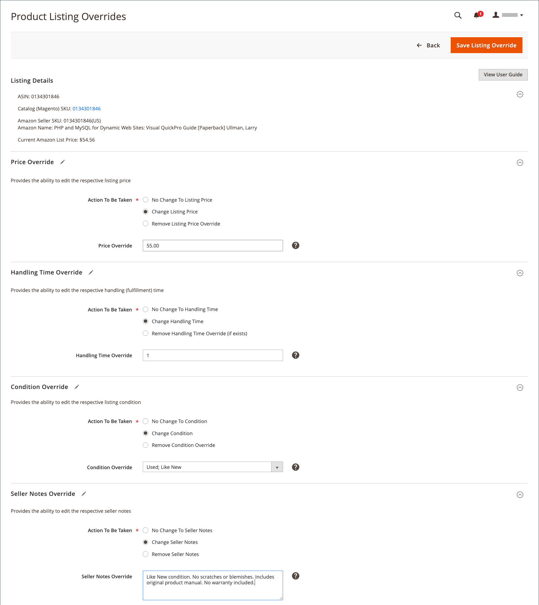

# Crear y editar invalidaciones

Puede crear y sustituir un anuncio, o editar o eliminar una anulación que se haya aplicado a un anuncio. Las invalidaciones definen un valor para un listado específico.

## Crear una anulación para un solo anuncio

El _[!UICONTROL Create Override]_La acción está disponible cuando se visualizan anuncios en_[!UICONTROL Inactive]_, _[!UICONTROL Active]_, y_[!UICONTROL Ineligible]_ pestañas.

1. Ver un anuncio de una _[!UICONTROL Products Listings]_página (_[!UICONTROL Inactive]_, _[!UICONTROL Active]_, y_[!UICONTROL Ineligible]_ pestaña).

1. En el _[!UICONTROL Action]_, haga clic en **[!UICONTROL Select]**>**[!UICONTROL Create Override]**para abrir la página Sustituciones de listado de productos.

   {width="220"}

1. Para asegurarte de que visualiza el anuncio correcto, comprueba la _[!UICONTROL Listing Details]_.

1. Determine el tipo de sustitución que está creando.

   Puede definir un único tipo de sustitución o cualquier combinación de tipos para el anuncio (precio, tiempo de manipulación, condición, notas del vendedor).

   - **Precio** - Haga clic **[!UICONTROL Change Listing Price]** e introduzca el valor de precio definido para **[!UICONTROL Price Override]**.
   - **Tiempo de manipulación** - Haga clic **[!UICONTROL Change Handling Time]** e introduzca el valor de tiempo definido (en días) para **[!UICONTROL Handling Time Override]**.
   - **Condición** - Haga clic **[!UICONTROL Change Condition]** y elija la opción correcta para la **[!UICONTROL Condition Override]**.
   - **Notas del vendedor** - Haga clic **[!UICONTROL Change Seller Notes]** e introduzca el texto de las notas para **[!UICONTROL Seller Notes Override]**.

1. Clic **[!UICONTROL Save Listing Override]**.

   El _[!UICONTROL Product Listing Overrides]_se cierra la página. El estado de la lista cambia a `Relist in Progress`. El cambio se publicará en Amazon con la siguiente sincronización de datos (según la configuración de cron). El anuncio también se agrega al_[!UICONTROL Overrides]_ pestaña.

El siguiente ejemplo muestra una anulación que define un nuevo precio de `$55`, un nuevo tiempo de manipulación de `1 day`, una nueva condición de `Used; Like New`y el nuevo texto de la nota al vendedor.

{width="600" zoomable="yes"}

## Modificar o eliminar una omisión en un solo anuncio {#edit-override-single-listing}

El _[!UICONTROL Edit Overrides]_La acción está disponible cuando se visualizan anuncios en_[!UICONTROL Overrides]_ pestaña.

1. Ver un anuncio en _[!UICONTROL Product Listings]_página (_[!UICONTROL Overrides]_ pestaña).

1. En el _[!UICONTROL Action]_, haga clic en **[!UICONTROL Select]**>**[!UICONTROL Edit Overrides]**.

   El _[!UICONTROL Product Listing Overrides]_se abre la página.

   {width="125"}

1. Para asegurarte de que anulas el anuncio correcto, comprueba la _[!UICONTROL Listing Details]_.

1. Para editar su _[!UICONTROL Override]_, defina las secciones para el tipo que desea cambiar (precio, tiempo de manipulación, condición, notas del vendedor).

   Para mantener el mismo tipo de anulación, seleccione `No Change To <override type>` (el valor predeterminado). Esta configuración no modifica el valor de anulación definido anteriormente.

   - **Precio** - Haga clic **[!UICONTROL Change Listing Price]** e introduzca el valor de precio definido para **[!UICONTROL Price Override]**.
   - **Tiempo de manipulación** - Haga clic **[!UICONTROL Change Handling Time]** e introduzca el valor de tiempo definido (en días) para **[!UICONTROL Handling Time Override]**.
   - **Condición** - Haga clic **[!UICONTROL Change Condition]** y elija la opción correcta para **[!UICONTROL Condition Override]**.
   - **Notas del vendedor** - Haga clic **[!UICONTROL Change Seller Notes]** e introduzca el texto de las notas para **[!UICONTROL Seller Notes Override]**.

1. Para quitar un tipo de anulación, haga clic en **Eliminar** para cada uno de los tipos que desee eliminar. Si no se elimina, el valor definido anteriormente permanece en la anulación.

1. Clic **[!UICONTROL Save Listing Override]**.

   El _[!UICONTROL Product Listing Overrides]_se cierra la página. El estado de la lista cambia a `Relist in Progress`. El cambio se publicará en Amazon con la siguiente sincronización de datos (según la configuración de cron). Si aún no aparecen en la lista, los anuncios también se agregan a la_[!UICONTROL Overrides]_ pestaña.

Piggyback en el _Crear una anulación_ ejemplo. El siguiente ejemplo muestra una edición de la anulación creada anteriormente que define un nuevo precio de `$50`, elimina la anulación de Tiempo de manejo y mantiene las anulaciones anteriores de Condición y Notas del vendedor.

{width="600" zoomable="yes"}
__

## Modificar o quitar una anulación de varios anuncios {#edit-override-multiple-listings}

El _[!UICONTROL Edit Listing Overrides]_La acción está disponible en la_[!UICONTROL Inactive]_, _[!UICONTROL Active]_,_[!UICONTROL Overrides]_, y _[!UICONTROL Ineligible]_pestañas.

>[!NOTE]
>
>Como estás modificando las anulaciones de varios anuncios, la variable _[!UICONTROL Listing Details]_no se muestra como al modificar un listado único.

1. Ver el anuncio de una _[!UICONTROL Products Listings]_página (_[!UICONTROL Inactive]_, _[!UICONTROL Active]_,_[!UICONTROL Overrides]_, y _[!UICONTROL Ineligible]_pestaña).

1. Seleccione la casilla de verificación de la columna del lado izquierdo para cada uno de los listados que desee modificar.

1. En _[!UICONTROL Actions]_, haga clic en **[!UICONTROL Edit Listing Overrides]**.

   El _[!UICONTROL Product Listing Overrides]_se abre la página.

   {width="200"}

1. Para editar su _[!UICONTROL Override]_, defina las secciones para el tipo que desea cambiar (precio, tiempo de manipulación, condición, notas del vendedor).

   Para mantener una anulación igual, seleccione `No Change To <override type>` (valor predeterminado). Esta configuración no modifica el valor de anulación definido anteriormente.

   - **Precio** - Haga clic **[!UICONTROL Change Listing Price]** e introduzca el valor de precio definido para **[!UICONTROL Price Override]**.
   - **Tiempo de manipulación** - Haga clic **[!UICONTROL Change Handling Time]** e introduzca el valor de tiempo definido (en días) para **[!UICONTROL Handling Time Override]**.
   - **Condición** - Haga clic **[!UICONTROL Change Condition]** y elija la opción correcta para **[!UICONTROL Condition Override]**.
   - **Notas del vendedor** - Haga clic **[!UICONTROL Change Seller Notes]** e introduzca el texto de las notas para **[!UICONTROL Seller Notes Override]**.

1. Para quitar un tipo de anulación, haga clic en **[!UICONTROL Remove]** para cada uno de los tipos que desee eliminar. Si no se elimina, el valor definido anteriormente permanece en la anulación.

1. Clic **[!UICONTROL Save Listing Override]**.

   El _[!UICONTROL Product Listing Overrides]_se cierra la página. El estado de los anuncios cambia a `Relist in Progress`. El cambio se publicará en Amazon con la siguiente sincronización de datos (según la configuración de cron). Si aún no aparecen en la lista, los anuncios también se agregan a la_[!UICONTROL Overrides]_ pestaña.

### Anular tipos

| Anular | Descripción |
|--- |--- |
| [!UICONTROL Price Override] | Una anulación de precio define el precio de los anuncios. Esta anulación tiene prioridad sobre todas las configuraciones automatizadas hasta que se elimine la anulación.  Para anular el precio del producto, elija **[!UICONTROL Change Listing Price]** e introduzca el nuevo precio para **[!UICONTROL Price Override]**. |
| [!UICONTROL Handling Time Override] | Una anulación del tiempo de manipulación define el tiempo que se tarda (en días) en procesar y enviar los productos. Una anulación del tiempo de manipulación tiene prioridad sobre todas las configuraciones de tiempo de manipulación automatizadas y predeterminadas hasta que se elimine la anulación.  El valor que existe en _[!UICONTROL Handling Time Override]_es el tiempo de manipulación predeterminado definido en su [configuración de listado](./listing-settings.md) o el tiempo de control de invalidaciones definido. Si se elimina una sustitución del tiempo de manipulación, el anuncio toma como valor predeterminado el tiempo de gestión definido en la configuración del anuncio.  Para definir una sustitución del tiempo de manipulación, seleccione **[!UICONTROL Change Handling Time]**e introduzca el nuevo tiempo de manipulación (en días) para **[!UICONTROL Handling Time Override]**. |
| [!UICONTROL Condition Override] | Para anular la condición de anuncio, seleccione **[!UICONTROL Change Condition]** y elija la nueva condición **Anulación de condición**. |
| [!UICONTROL Seller Notes Override] | Para productos del catálogo que se definen con una condición distinta a `New`, se puede añadir una nota al vendedor para detallar el producto y su condición a los compradores potenciales. Puedes introducir una anulación de nota de vendedor para un `New` condición del producto, pero Amazon no muestra la nota.  Para anular las notas del vendedor, selecciona **[!UICONTROL Change Seller Notes]** e introduzca la nueva nota para **[!UICONTROL Seller Notes Override]**. |
