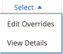

# Crear y editar invalidaciones

Puede crear y sustituir un anuncio, o editar o eliminar una anulación que se haya aplicado a un anuncio. Las invalidaciones definen un valor para un listado específico.

## Crear una anulación para un solo anuncio

La acción _[!UICONTROL Create Override]_está disponible al ver los listados de las fichas_[!UICONTROL Inactive]_, _[!UICONTROL Active]_y_[!UICONTROL Ineligible]_.

1. Ver un listado en una página de _[!UICONTROL Products Listings]_(ficha_[!UICONTROL Inactive]_, _[!UICONTROL Active]_y_[!UICONTROL Ineligible]_).

1. En la columna _[!UICONTROL Action]_, haga clic en **[!UICONTROL Select]**>**[!UICONTROL Create Override]**para abrir la página de invalidaciones de listado de productos.

   {width="220"}

1. Para asegurarse de que está viendo el listado correcto, compruebe _[!UICONTROL Listing Details]_.

1. Determine el tipo de sustitución que está creando.

   Puede definir un único tipo de sustitución o cualquier combinación de tipos para el anuncio (precio, tiempo de manipulación, condición, notas del vendedor).

   - **Precio** - Haz clic en **[!UICONTROL Change Listing Price]** e introduce el valor de precio definido para **[!UICONTROL Price Override]**.
   - **Tiempo de manipulación** - Haga clic en **[!UICONTROL Change Handling Time]** e introduzca el valor de tiempo definido (en días) para **[!UICONTROL Handling Time Override]**.
   - **Condición** - Haga clic en **[!UICONTROL Change Condition]** y elija la opción correcta para **[!UICONTROL Condition Override]**.
   - **Notas del vendedor** - Haz clic en **[!UICONTROL Change Seller Notes]** e introduce el texto de las notas de **[!UICONTROL Seller Notes Override]**.

1. Haga clic en **[!UICONTROL Save Listing Override]**.

   Se cierra la página _[!UICONTROL Product Listing Overrides]_. El estado del listado cambia a `Relist in Progress`. El cambio se publicará en Amazon con la siguiente sincronización de datos (según la configuración de cron). El listado también se agrega a la ficha_[!UICONTROL Overrides]_.

El siguiente ejemplo muestra una invalidación que define un nuevo precio de `$55`, un nuevo tiempo de manipulación de `1 day`, una nueva condición de `Used; Like New` y un nuevo texto de nota de vendedor.

{width="600" zoomable="yes"}

## Modificar o eliminar una omisión en un solo anuncio {#edit-override-single-listing}

La acción _[!UICONTROL Edit Overrides]_está disponible al ver los anuncios de la ficha_[!UICONTROL Overrides]_.

1. Ver un listado en la página _[!UICONTROL Product Listings]_(ficha_[!UICONTROL Overrides]_).

1. En la columna _[!UICONTROL Action]_, haga clic en **[!UICONTROL Select]**>**[!UICONTROL Edit Overrides]**.

   Se abre la página _[!UICONTROL Product Listing Overrides]_.

   {width="125"}

1. Para asegurarse de que está anulando el listado correcto, compruebe _[!UICONTROL Listing Details]_.

1. Para editar la configuración de _[!UICONTROL Override]_, defina las secciones del tipo que desee cambiar (Precio, Tiempo de manipulación, Condición, Notas del vendedor).

   Para mantener el mismo tipo de invalidación, seleccione `No Change To <override type>` (valor predeterminado). Esta configuración no modifica el valor de anulación definido anteriormente.

   - **Precio** - Haz clic en **[!UICONTROL Change Listing Price]** e introduce el valor de precio definido para **[!UICONTROL Price Override]**.
   - **Tiempo de manipulación** - Haga clic en **[!UICONTROL Change Handling Time]** e introduzca el valor de tiempo definido (en días) para **[!UICONTROL Handling Time Override]**.
   - **Condición** - Haga clic en **[!UICONTROL Change Condition]** y elija la opción correcta para **[!UICONTROL Condition Override]**.
   - **Notas del vendedor** - Haz clic en **[!UICONTROL Change Seller Notes]** e introduce el texto de las notas de **[!UICONTROL Seller Notes Override]**.

1. Para quitar un tipo de invalidación, haga clic en **Quitar** para cada uno de los tipos que desee quitar. Si no se elimina, el valor definido anteriormente permanece en la anulación.

1. Haga clic en **[!UICONTROL Save Listing Override]**.

   Se cierra la página _[!UICONTROL Product Listing Overrides]_. El estado del listado cambia a `Relist in Progress`. El cambio se publicará en Amazon con la siguiente sincronización de datos (según la configuración de cron). Si aún no aparecen en la lista, los listados también se agregan a la ficha_[!UICONTROL Overrides]_.

En el ejemplo de _Crear un reemplazo_. El ejemplo siguiente muestra una edición de la invalidación creada anteriormente que define un nuevo precio de `$50`, elimina la invalidación de tiempo de manejo y mantiene las invalidaciones anteriores de condición y notas de vendedor.

{width="600" zoomable="yes"}
__

## Modificar o quitar una anulación de varios anuncios {#edit-override-multiple-listings}

La acción _[!UICONTROL Edit Listing Overrides]_está disponible en las fichas_[!UICONTROL Inactive]_, _[!UICONTROL Active]_,_[!UICONTROL Overrides]_ y _[!UICONTROL Ineligible]_.

>[!NOTE]
>
>Como está modificando invalidaciones para varios listados, la sección _[!UICONTROL Listing Details]_no se muestra como al modificar un solo listado.

1. Ver el listado en una página de _[!UICONTROL Products Listings]_(ficha_[!UICONTROL Inactive]_, _[!UICONTROL Active]_,_[!UICONTROL Overrides]_ y _[!UICONTROL Ineligible]_).

1. Seleccione la casilla de verificación de la columna del lado izquierdo para cada uno de los listados que desee modificar.

1. En _[!UICONTROL Actions]_, haga clic en **[!UICONTROL Edit Listing Overrides]**.

   Se abre la página _[!UICONTROL Product Listing Overrides]_.

   {width="200"}

1. Para editar la configuración de _[!UICONTROL Override]_, defina las secciones del tipo que desee cambiar (Precio, Tiempo de manipulación, Condición, Notas del vendedor).

   Para mantener una invalidación igual, seleccione `No Change To <override type>` (predeterminado). Esta configuración no modifica el valor de anulación definido anteriormente.

   - **Precio** - Haz clic en **[!UICONTROL Change Listing Price]** e introduce el valor de precio definido para **[!UICONTROL Price Override]**.
   - **Tiempo de manipulación** - Haga clic en **[!UICONTROL Change Handling Time]** e introduzca el valor de tiempo definido (en días) para **[!UICONTROL Handling Time Override]**.
   - **Condición** - Haga clic en **[!UICONTROL Change Condition]** y elija la opción correcta para **[!UICONTROL Condition Override]**.
   - **Notas del vendedor** - Haz clic en **[!UICONTROL Change Seller Notes]** e introduce el texto de las notas de **[!UICONTROL Seller Notes Override]**.

1. Para quitar un tipo de invalidación, haga clic en **[!UICONTROL Remove]** para cada uno de los tipos que desee quitar. Si no se elimina, el valor definido anteriormente permanece en la anulación.

1. Haga clic en **[!UICONTROL Save Listing Override]**.

   Se cierra la página _[!UICONTROL Product Listing Overrides]_. El estado de los listados cambia a `Relist in Progress`. El cambio se publicará en Amazon con la siguiente sincronización de datos (según la configuración de cron). Si aún no aparecen en la lista, los listados también se agregan a la ficha_[!UICONTROL Overrides]_.

### Anular tipos

| Anular | Descripción |
|-------------------------------------|-------------------------------------------------------------------------------------------------------------------------------------------------------------------------------------------------------------------------------------------------------------------------------------------------------------------------------------------------------------------------------------------------------------------------------------------------------------------------------------------------------------------------------------------------------------------------------------------------------------------------------------------------------------------------------------------------------------------------------------------------|
| [!UICONTROL Price Override] | Una anulación de precio define el precio de los anuncios. Esta anulación tiene prioridad sobre todas las configuraciones automatizadas hasta que se elimine la anulación.  Para anular el precio del producto, elige **[!UICONTROL Change Listing Price]** e introduce el nuevo precio de **[!UICONTROL Price Override]**. |
| [!UICONTROL Handling Time Override] | Una anulación del tiempo de manipulación define el tiempo que se tarda (en días) en procesar y enviar los productos. Una anulación del tiempo de manipulación tiene prioridad sobre todas las configuraciones de tiempo de manipulación automatizadas y predeterminadas hasta que se elimine la anulación.  El valor que existe en el cuadro _[!UICONTROL Handling Time Override]_es el tiempo de manipulación predeterminado definido en la [configuración del anuncio](./listing-settings.md) o el tiempo de manipulación de invalidación definido. Si se elimina una sustitución del tiempo de manipulación, el anuncio toma como valor predeterminado el tiempo de gestión definido en la configuración del anuncio.  Para definir una anulación de tiempo de manipulación, elija **[!UICONTROL Change Handling Time]**e introduzca el nuevo tiempo de manipulación (en días) para **[!UICONTROL Handling Time Override]**. |
| [!UICONTROL Condition Override] | Para anular la condición del listado, elige **[!UICONTROL Change Condition]** y elige la nueva condición de **Anulación de condición**. |
| [!UICONTROL Seller Notes Override] | Para los productos de su catálogo que se definen con una condición distinta de `New`, se puede agregar una nota de vendedor para detallar el producto y su condición para posibles compradores. Puede introducir una anulación de nota de vendedor para un producto de condición `New`, pero Amazon no muestra la nota.  Para anular las notas del vendedor, elige **[!UICONTROL Change Seller Notes]** e introduce la nueva nota de **[!UICONTROL Seller Notes Override]**. |
