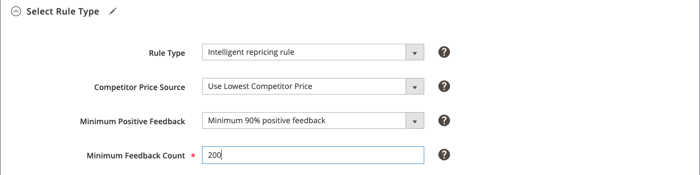

# Regla de reasignación de precios inteligente: Seleccionar tipo de regla

>[!IMPORTANT]
>
>Las reglas de reasignación de precios inteligentes no funcionan correctamente si la región de Amazon está configurada con el estado `Inactive`, tal como sucede durante la incorporación. Los cálculos de precios dependen de las tarifas de envío y la región debe tener el estado `Active` para que se sincronicen las tarifas de envío desde Amazon.  
>
>Para actualizar el estado de tu región en la cuenta de Amazon, ve a Configuración > Información de la cuenta > Configuración de vacaciones. Consulte [Amazon: Estado del anuncio para las vacaciones](https://sellercentral.amazon.com/gp/help/help.html?itemID=200135620/&quot;target=&quot;_blank)

Una regla de reasignación de precios inteligente emplea los precios de los competidores de Amazon para determinar el precio del anuncio. Los competidores son otros vendedores que enumeran los mismos productos que el suyo en Amazon.

Las secciones de una regla de reasignación de precios inteligente incluyen:

- Seleccionar tipo de regla
- [Variaciones condicionales del competidor](./competitor-conditional-variances.md)
- [Ajuste de precio](./price-adjustment.md)
- [Precio mínimo](./floor-price.md)
- [Precio de techo opcional](./optional-ceiling-price.md)

## Configuración del tipo de regla

Defina el tipo de regla en la sección _[!UICONTROL Select Rule Type]_.

1. Para **[!UICONTROL Rule Type]**, elija `Intelligent repricing rule`.

   Esta configuración habilita el campo _[!UICONTROL Competitor Price Source]_y las secciones [_[!UICONTROL Competitor Conditional Variances]_](./competitor-conditional-variances.md), [_[!UICONTROL Floor Price]_](./floor-price.md) y [_[!UICONTROL Optional Ceiling Price]_](./optional-ceiling-price.md).

1. Para **[!UICONTROL Competitor Price Source]**, elija una opción:

   - **[!UICONTROL Use "Buy Box" Price]**: elige cuándo quieres ajustar los precios de Amazon según el precio de vendedor de Amazon [[!DNL Buy Box]](./buy-box-competitor-pricing.md). Existe un precio de [!DNL Buy Box] cuando varios vendedores en Amazon ofrecen el mismo producto. Amazon define el vendedor [!DNL Buy Box] según los requisitos de rendimiento. Los comerciantes buscan ganar el estado de vendedor [!DNL Buy Box] y ofrecer la máxima visibilidad a sus anuncios de productos.

   - **[!UICONTROL Use Lowest Competitor Price]**: elige cuándo quieres comparar y ajustar el precio del anuncio a los precios de la competencia para el mismo producto. Cuando se elige, los campos _[!UICONTROL Minimum Positive Feedback]_y_[!UICONTROL Minimum Feedback Count]_ están habilitados.

1. Si está habilitada, elija una opción para **[!UICONTROL Minimum Positive Feedback]**.

   - **[!UICONTROL All Competitor's Prices]**: elija cuándo desea comparar y ajustar los precios en función de todos los precios de la competencia para el mismo producto.

   - **[!UICONTROL Minimum 80/90/95/98% positive feedback]**: elija cuándo desea limitar los competidores con los que se compara el precio del mismo producto. Esta configuración reduce aún más a los competidores al exigir que sus anuncios tengan un mínimo del porcentaje elegido de comentarios positivos antes de aplicar la regla de precio más bajo.

1. Si está habilitado, escriba un valor numérico para **[!UICONTROL Minimum Feedback Count]**.

   Este valor numérico opcional reduce aún más los precios competitivos. Por ejemplo, si un comerciante tiene un 95 % de votos positivos, pero solo tiene un recuento de votos de `20`, es posible que no sea un competidor en el que desee modificar los precios. Sin embargo, si escribe un valor de `1000`, se requiere que el comerciante tenga un 95% de comentarios positivos y un mínimo de 1000 revisiones de comerciante.

>[!NOTE]
>
>Puede utilizar estas opciones de precios y comentarios de la competencia para evitar basar los precios en un competidor que tiene comentarios deficientes y que vende un producto de menor calidad.

{width="600" zoomable="yes"}

| Campo | Descripción |
|----------------------------------------|-----------------------------------------------------------------------------------------------------------------------------------------------------------------------------------------------------------------------------------------------------------------------------------------------------------------------------------------------------------------------------------------------------------------------------------------------------------------------------------------------------------------------------------------------------------------------------------------------------------------------------------------------------------------------------------------------------------------------------------------------------------------------------------------------------------------------------------------------------------------------------------------|
| [!UICONTROL Rule Type] | Seleccione un tipo de regla. Opciones:<ul><li>**[!UICONTROL Standard price rule]**: este tipo de regla le permite aumentar o reducir el precio de listado de Amazon en un porcentaje específico o en una cantidad en dólares fijos en relación con _[!UICONTROL Magento Price Source]_. </li><li>**[!UICONTROL Intelligent repricing rule]**: este tipo de regla permite ajustar el precio del anuncio de Amazon según los precios de la competencia. Cuando se elige, los campos _[!UICONTROL Minimum Positive Feedback]_y_[!UICONTROL Minimum Feedback Count]_ están habilitados.</li></ul> |
| [!UICONTROL Competitor Price Source] | Seleccione el origen de precio deseado. Opciones:<ul><li>**[!UICONTROL Use "Buy Box" Price]**: elige esta opción cuando quieras ajustar los precios de Amazon según el precio de vendedor de Amazon [[!DNL Buy Box]](./buy-box-competitor-pricing.md). Existe un precio de [!DNL Buy Box] cuando varios vendedores en Amazon ofrecen el mismo producto. Amazon define el vendedor [!DNL Buy Box] según los requisitos de rendimiento. Los comerciantes buscan ganar el estado de vendedor [!DNL Buy Box] y ofrecer la máxima visibilidad a sus anuncios de productos.</li><li>**[!UICONTROL Use Lowest Competitor Price]**: elige esta opción cuando quieras comparar y ajustar el precio de tu anuncio al [precio más bajo de la competencia](./lowest-competitor-pricing.md) para el mismo producto. Cuando se elige, los campos _[!UICONTROL Minimum Positive Feedback]_y_[!UICONTROL Minimum Feedback Count]_ están habilitados.</li></ul> |
| [!UICONTROL Minimum Positive Feedback] | Solo está activo si se elige `Use Lowest Competitor Price`. Opciones:<ul><li>**[!UICONTROL All Competitor's Prices]**: elija cuándo desea comparar y ajustar los precios en función de todos los precios de la competencia para el mismo producto.</li><li>**[!UICONTROL Minimum 80/90/95/98% positive feedback]**: elija cuándo desea limitar los competidores con los que compara y ajuste los precios. Esta configuración reduce aún más a sus competidores al exigir que sus anuncios tengan un mínimo del porcentaje elegido de comentarios positivos y luego utilicen el precio más bajo de ese subconjunto de competidores.</li></ul> |
| [!UICONTROL Minimum Feedback Count] | Solo está activo si se elige `Use Lowest Competitor Price`. Este valor numérico opcional reduce aún más la comparación de precios competitivos. Por ejemplo, si un comerciante tiene un índice de votos positivos del 95 % pero solo tiene un recuento de votos de `20`, es posible que no sea un competidor en el que desee modificar el precio. Sin embargo, si escribe un valor de `1000`, se requiere que el comerciante tenga un 95% de comentarios positivos y un mínimo de 1000 revisiones de comerciante. |
