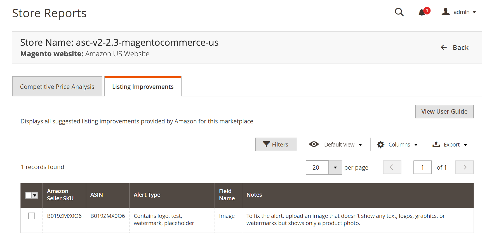

# [!UICONTROL Listing Improvements]

El [!UICONTROL Listing Improvements] El informe muestra los productos con sugerencias de Amazon para mejorar la calidad del anuncio. Puede revisar estas sugerencias, que podrían ayudar al rendimiento de los productos dentro de la lista de Amazon. No hay acciones disponibles para el registro. Es una función de solo revisión.

Una mejora en la lista recibida de Amazon no impide que el producto aparezca en la lista de Amazon.

{width="600" zoomable="yes"}

## Columnas predeterminadas

| Columna | Descripción |
|--------------------------------|------------------------------------------------------------------------------------------------------------------------------------------------------------------------------------------------------------------------------------------------------------------------------------------------------------------------------------------------------------------------------------------------------------------------------------------------------------------------------------------|
| [!UICONTROL Amazon Seller SKU] | El SKU (código de referencia) asignado por Amazon a un producto para identificar el producto, las opciones, el precio y el fabricante. |
| [!UICONTROL ASIN] | Bloque único de 10 letras o números que identifican elementos.  ASIN significa el [!DNL Amazon Standard Identification Number]. Un ASIN es un bloque único de 10 letras y/o números que identifican elementos. Para los libros, el ASIN es el mismo que el número ISBN, pero para todos los demás productos se crea un nuevo ASIN cuando el artículo se carga en su catálogo. Puede encontrar artículos ASIN en la página de detalles del producto de Amazon, junto con más detalles relacionados con el artículo. |
| [!UICONTROL Alert Type] | Describe el tipo de problema con la lista. Por ejemplo, &quot;Falta&quot; indica que falta un atributo requerido. |
| [!UICONTROL Field Name] | Nombre del campo en los detalles del anuncio de vendedor de Amazon cuya mejora se recomienda. |
| [!UICONTROL Notes] | Descripción de la mejora sugerida recibida de Amazon. |
