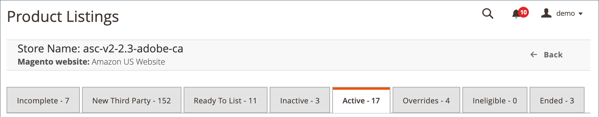

# Administrar listas de productos por estado/ficha

La página _[!UICONTROL Product Listings]_contiene varias pestañas desde las que puede ver los estados de todos sus anuncios y hacer coincidir sus productos con los listados de Amazon.

Las tareas de listado disponibles difieren ligeramente en cada ficha, pero los [controles del espacio de trabajo](./workspace-controls.md) son los mismos y le permiten personalizar los datos que se muestran para sus listados.

Las opciones de **[!UICONTROL Actions]** pueden aplicar la acción a varios listados, mientras que las opciones de **[!UICONTROL Select]** en la columna _[!UICONTROL Action]_aplican la acción solo a los listados individuales.

Consulte también [Administrar anuncios por acción](./managing-listings-by-action.md).

| Tabulación | Descripción | Acciones |
|--- |--- |--- |
| [[!UICONTROL Incomplete]](./incomplete-listings.md) | Muestra los productos del catálogo de [!DNL Commerce] que cumplen con la configuración de listado definida pero que carecen de la información requerida por Amazon para un listado.  Si  _[!UICONTROL Automatic List Action]_está establecido  `Automatically List Eligible Products` en en la  [_[!UICONTROL Product Listing Actions]_](./product-listing-actions.md) configuración, estos elementos son su **[!UICONTROL In Progress Listings]**. | [!UICONTROL Reattempt auto match to Amazon Listing] [[!UICONTROL Update Required Info]](./amazon-manually-update-incomplete-listing.md) [[!UICONTROL View Details]](./product-listing-details.md) |
| [[!UICONTROL New Third Party]](./new-third-party-listings.md) | Muestra las listas de Amazon existentes (según la información recibida de Amazon) que no coinciden con un producto de su catálogo [!DNL Commerce]. | [[!UICONTROL Create New Catalog Product(s)]](./creating-assigning-catalog-products.md) Intentar coincidencia automática [[!UICONTROL Assign Catalog Product]](./creating-assigning-catalog-products.md) [[!UICONTROL Create New Catalog Product]](./creating-assigning-catalog-products.md) [[!UICONTROL View Details]](./product-listing-details.md) |
| [[!UICONTROL Ready to List]](./ready-to-list.md) | Muestra los productos de catálogo que están listos para crear anuncios de Amazon, pero la tienda no está configurada para publicar automáticamente nuevos anuncios. Esta pestaña se utiliza para publicar manualmente los nuevos anuncios.  Si  _[!UICONTROL Automatic List Action]_está establecido  `Do Not Automatically List Eligible Products` en en la  [_[!UICONTROL Product Listing Actions]_](./product-listing-actions.md) configuración, estos elementos son su **[!UICONTROL In Progress Listings]**. | [[!UICONTROL Publish Product to Amazon]](./publish-listings-manually.md) [[!UICONTROL Publish On Amazon]](./publish-listings-manually.md) [[!UICONTROL View Details]](./product-listing-details.md) |
| [[!UICONTROL Inactive]](./inactive-listings.md) | Muestra los productos del catálogo que se han publicado en Amazon, pero Amazon no ha aprobado el listado para el estado Activo. | [ EndListing(s) en ](./end-listings-manually.md) [[!UICONTROL Edit Listing Overrides]](./creating-editing-overrides.md) [[!UICONTROL View Details]](./product-listing-details.md) [[!UICONTROL Create Override]](./creating-editing-overrides.md) [[!UICONTROL Edit Assigned ASIN]](./edit-assigned-asin.md) [[!UICONTROL Create Alias Seller SKU]](./create-alias-seller-sku.md#region-specific) AmazonSwitch a Fulfill por Amazon/Merchant [[!UICONTROL End Listing]](./end-listings-manually.md) |
| [[!UICONTROL Active]](./active-listings.md) | Muestra las listas de Amazon que coinciden con un producto de su catálogo [!DNL Commerce], que se han publicado en Amazon y que han sido publicadas por Amazon para el estado Activo. | [[!UICONTROL End Listing(s) on Amazon]](./end-listings-manually.md) [[!UICONTROL Edit Listing Overrides]](./creating-editing-overrides.md) [[!UICONTROL View Details]](./product-listing-details.md) [[!UICONTROL Create Override]](./creating-editing-overrides.md) [[!UICONTROL Edit Assigned ASIN]](./edit-assigned-asin.md) [[!UICONTROL Create Alias Seller SKU]](./create-alias-seller-sku.md#region-specific) Cambiar a Satisfecho por Amazon/Comerciante [[!UICONTROL End Listing]](./end-listings-manually.md) |
| [[!UICONTROL Overrides]](./overrides.md) | Muestra los anuncios de Amazon que cumplen los criterios de una anulación definida y a los que se ha aplicado la anulación. Las anulaciones tienen prioridad sobre cualquier otra configuración de cuenta. | [[!UICONTROL Edit Listing Overrides]](./creating-editing-overrides.md) [[!UICONTROL Edit Overrides]](./creating-editing-overrides.md) [[!UICONTROL View Details]](./product-listing-details.md) |
| [[!UICONTROL Ineligible]](./ineligible-listings.md) | Muestra los anuncios de Amazon existentes que ya no son aptos, según la [configuración de listado](./listing-settings.md) definida. | [[!UICONTROL End Listing(s) on Amazon]](./end-listings-manually.md) [[!UICONTROL Edit Listing Overrides]](./creating-editing-overrides.md) [[!UICONTROL View Details]](./product-listing-details.md) [[!UICONTROL Create Override]](./creating-editing-overrides.md) [[!UICONTROL Edit Assigned ASIN]](./edit-assigned-asin.md) [[!UICONTROL Create Alias Seller SKU]](./create-alias-seller-sku.md#region-specific) Cambiar a Satisfecho por Amazon/Comerciante [[!UICONTROL End Listing]](./end-listings-manually.md) |
| [[!UICONTROL Ended]](./ended-listings.md) | Muestra los anuncios de Amazon que se han finalizado (eliminado) manualmente de Amazon. | [[!UICONTROL Publish Product to Amazon]](./publish-listings-manually.md) [[!UICONTROL View Details]](./product-listing-details.md) [[!UICONTROL Publish On Amazon]](./publish-listings-manually.md) [[!UICONTROL Create Alias Seller SKU]](./create-alias-seller-sku.md#region-specific) |

## Acceso a listas de productos

1. En la barra lateral _Admin_, vaya a **[!UICONTROL Marketing]** > _[!UICONTROL Channels]_>**[!UICONTROL Amazon Sales Channel]**.

1. Haga clic **[!UICONTROL View Store]** en la tarjeta de la tienda.

1. En el panel de la tienda, haga clic en **[!UICONTROL Manage Listings]** en la sección _[!UICONTROL Store Listings]_.
