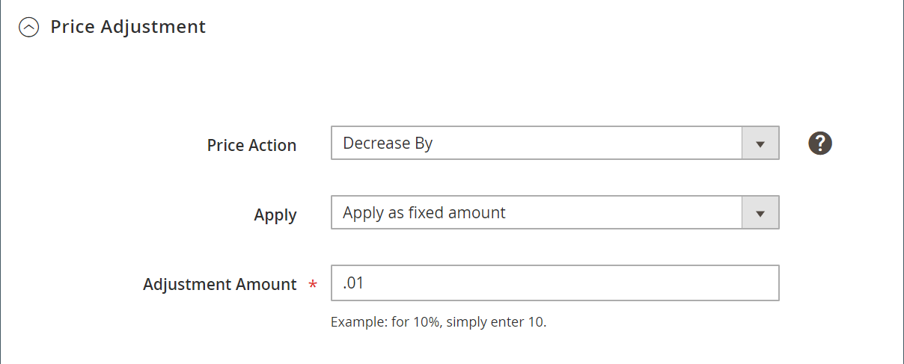

# [!UICONTROL Price Adjustment]

>[!NOTE]
>
>La sección Ajuste de Precio difiere ligeramente para las reglas de reasignación de precios Estándar e Inteligente. **[!UICONTROL Match Competitor Price]** solo está disponible en _[!UICONTROL Price Action]_cuando **[!UICONTROL Rule Type]**se establece en `Intelligent repricing rule`.

Las secciones de una regla de reasignación de precios inteligente incluyen:

- [Seleccionar tipo de regla](./intelligent-repricing-rules.md)
- [Variaciones condicionales del competidor](./competitor-conditional-variances.md)
- Ajuste de precio
- [Precio mínimo](./floor-price.md)
- [Precio de techo opcional](./optional-ceiling-price.md)

El ajuste de precios define el cálculo de precios cuando se ha identificado el origen de precios del competidor.

## Configuración del ajuste de precios

Defina el ajuste de precios en la _[!UICONTROL Price Adjustment]_sección.

1. Para **[!UICONTROL Price Action]**, elija una opción:

   - `Decrease By` : elija cuándo desea que se ajuste el valor de origen del precio definido hacia abajo, lo que crea un precio más bajo para la regla, antes de ponerla en venta en Amazon.

   - `Increase By` : elija cuándo desea ajustar el valor de origen del precio definido, creando un precio más alto para la regla, antes de ponerlo en venta en Amazon.

   - `Match Competitor Price` - (Solo regla de reasignación de precios inteligente) Elija cuándo desea cambiar el precio del anuncio de Amazon para que coincida con el [competidor más bajo](./lowest-competitor-pricing.md) precio, en función de los comentarios de la competencia y los parámetros de variación. Cuando se establece en `Match Competitor Price`, el _[!UICONTROL Apply]_y_[!UICONTROL Adjustment Amount]_ Los campos de se eliminan.

1. Para **[!UICONTROL Apply]**, elija una opción:

   - `Apply as percentage` - Elija cuándo desea que se defina el **[!UICONTROL Magento Price Source]** definido en su [Precio del anuncio](./listing-price.md) ajustado en un porcentaje.

   - `Apply as fixed amount` - Elija cuándo desea que se defina el **[!UICONTROL Magento Price Source]** definido en su [Precio del anuncio](./listing-price.md) ajustado en una cantidad fija.

1. Para **[!UICONTROL Adjustment Amount]** (obligatorio), introduzca el valor numérico para el ajuste de precio.

   - Cuándo **[!UICONTROL Apply]** se establece en `Apply as percentage`, introduzca el valor porcentual (por ejemplo: introduzca `25` para un ajuste del 25%).

   - Cuándo **[!UICONTROL Apply]** se establece en `Apply as fixed amount`, introduzca el valor numérico para el importe fijo (por ejemplo: introduzca `25` para un ajuste fijo de 25 dólares).

{width="600" zoomable="yes"}

| Campo | Descripción |
|---|---|
| [!UICONTROL Price Action] | Seleccione una acción de ajuste de precios. Opciones: **[!UICONTROL Decrease By]**- Elija cuándo desea que se defina el _[!UICONTROL Magento Price Source]_definido en su [Precio del anuncio](./listing-price.md) para ajustarlo a la baja, creando un precio más bajo para la regla, antes de ponerlo en venta en Amazon. **[!UICONTROL Increase By]**- Elija cuándo desea que se defina el_[!UICONTROL Magento Price Source]_ definido en su [Precio del anuncio](./listing-price.md) para ajustarlo, creando un precio más alto para la regla, antes de ponerlo en venta en Amazon. **[!UICONTROL Match Competitor Price]**- (Solo regla de reasignación de precios inteligente) Elija cuándo desea cambiar el precio del anuncio de Amazon para que coincida con el [competidor más bajo](./lowest-competitor-pricing.md) precio, en función de los comentarios de la competencia y los parámetros de variación. Cuando se elige, la variable _Aplicar_ y _Importe ajuste_ Los campos de se eliminan. |
| [!UICONTROL Apply] | Opciones: **[!UICONTROL Apply as percentage]**- Elija cuándo desea que se defina el _[!UICONTROL Magento Price Source]_definido en su [Precio del anuncio](./listing-price.md) ajustado en un porcentaje. **[!UICONTROL Apply as fixed amount]**- Elija cuándo desea que se defina el_[!UICONTROL Magento Price Source]_ definido en su [Precio del anuncio](./listing-price.md) ajustado en una cantidad fija. |
| [!UICONTROL Adjustment Amount] | Requerido. Si elige `Apply as percentage` para **[!UICONTROL Apply]**, introduzca el valor porcentual (por ejemplo: introduzca `25` para un ajuste del 25%). Si elige `Apply as fixed amount` para **[!UICONTROL Apply]**, introduzca el valor numérico para el importe fijo (por ejemplo: introduzca `25` para un ajuste fijo de 25 dólares). |
