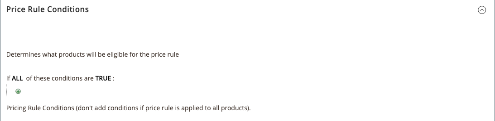
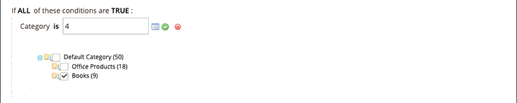

# Condiciones de Regla de Precio

Las condiciones determinan qué productos cumplen los requisitos para la regla de precio. La definición de las condiciones para las reglas de precios de Amazon sigue la misma lógica y proceso que la definición de las condiciones para [Reglas de precio de carrito](https://docs.magento.com/user-guide/marketing/price-rules-cart.html){target="_blank"} in [!DNL Commerce].

>[!IMPORTANT]
>
>Si la regla de precios se aplica a todos los productos de su [!DNL Commerce] catálogo y deje esta sección en blanco.

Se puede hacer clic en cualquier área de las condiciones que esté en negrita para ver las distintas opciones.

## Ejemplo: Creación de una condición de regla de precio

Este proceso puede ser sencillo o detallado, en función de la configuración del catálogo. Puede definir las condiciones para que cuando `ALL` o `ANY` Una de las condiciones es `TRUE` o `FALSE` para un producto, el producto es elegible para la regla de precios que se va a aplicar.

Las condiciones se basan en su [atributos del producto](https://docs.magento.com/user-guide/catalog/product-attributes.html){target="_blank"}. Para aplicar la regla a todos los productos, deje en blanco la sección de condiciones.

>[!NOTE]
>
>Si desea definir una condición basada en un atributo de producto específico, **Usar para condiciones de regla de promoción** para el atributo debe configurarse como `Yes` en su [Propiedades de tienda](https://docs.magento.com/user-guide/stores/attribute-product-create.html){target="_blank"} para el atributo.

En este ejemplo se define una regla que aplica un descuento del 25% a todos los productos definidos en la variable `Books` categoría.

La instrucción de regla tiene dos vínculos en negrita que, al hacer clic en ellos, muestran las opciones de esa parte de la instrucción de condición. Si guarda la condición sin cambiar una opción en negrita, la regla se aplica a todos los productos.

- Clic **[!UICONTROL ALL]** y elija `ALL` o `ANY`.
- Clic **[!UICONTROL TRUE]** y elija una de las siguientes opciones `TRUE` o `FALSE`.
- Para aplicar la regla a todos los productos, deje la condición sin cambios.

Puede crear diferentes condiciones cambiando la combinación de estos valores. Para este ejemplo, se utiliza la siguiente condición:

`If ALL of these conditions are TRUE:`

1. Para mostrar los atributos disponibles para los que se aplica la condición, haga clic en Añadir () icono al principio de la línea de condición y seleccione un atributo en el que basar la condición.

   **[!UICONTROL Conditions Combination]** : elija crear otro conjunto de `All/Any` y `True/False` condiciones dentro de la condición existente.

   

   **[!UICONTROL Product Attribute]** - Los atributos de producto disponibles dependen del [configuración del atributo](https://docs.magento.com/user-guide/stores/attribute-product-create.html){target="_blank"}. For an attribute to show in the list, *[!UICONTROL Use for Promo Rule Conditions]* for the attribute must be set to `Yes` in your [storefront properties](https://docs.magento.com/user-guide/stores/attribute-product-create.html){target="_blank"}.

   - Para **[!UICONTROL Product Attribute]**, elija el atributo que desea definir como base de la condición. Para este ejemplo, la condición seleccionada es `Category`.

      

      La condición seleccionada aparece en la instrucción, seguida de dos vínculos en negrita más. Las opciones difieren según el atributo de producto que seleccione.

      Una vez establecido el atributo, no se puede editar. Para cambiar el atributo, debe eliminar la línea y agregar el nuevo atributo. Puede eliminar una línea de condición haciendo clic en el botón Eliminar ( al final de la línea.

   - Clic **[!UICONTROL is]** y elija el operador de comparación que describe la condición que deben cumplir los productos.

      Para este ejemplo, el operador de comparación es `is`. Las opciones disponibles dependen del atributo seleccionado en el paso anterior y podrían incluir diferentes opciones de comparación. Las opciones pueden incluir valores coincidentes, sin incluir al menos uno de un valor, y bueno que, igual a y menor que una cantidad numérica. En este ejemplo, las opciones son `is` y `is not`.

   - Clic **[!UICONTROL ...]** y elija el valor de atributo en el que se basa la condición. Las opciones dependen de la configuración del atributo.

      Puede que se le pida que seleccione una opción o que introduzca un valor para la condición. Para este ejemplo, el campo aparece en blanco. Para seleccionar las categorías de la regla, haga clic en el icono del selector () para mostrar las opciones de selección. Esta regla es para _Libros_, seleccione la **[!UICONTROL Books]** casilla de verificación El número de categoría se rellena. Para aceptar las selecciones de categoría, haga clic en el icono de marca de verificación verde ().

      

      El elemento seleccionado aparece en la instrucción para completar la condición.

      

      Esta condición de ejemplo está completa. Como se ha indicado, esta condición significa que cualquier producto de [!DNL Commerce] catálogo que tiene una categoría definida de Libros (`4`) cumple los requisitos para esta regla de precios. Puede añadir más líneas de condición para reducir aún más los productos aptos.

1. Para agregar otra línea de condición a la instrucción, vuelva al paso 1 y repita el proceso hasta que se hayan completado todas las condiciones deseadas.

   Puede eliminar una línea de la instrucción de condición en cualquier momento haciendo clic en el botón Eliminar () icono al final de la línea.
