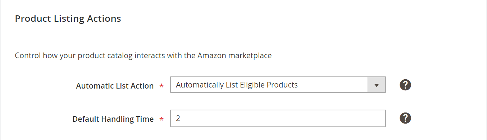

# Acciones de lista de productos

La configuración de acciones de listado de productos forma parte de la configuración de listado de tiendas. Se accede a la configuración de anuncio desde el [tablero de tienda](./amazon-store-dashboard.md).

Esta configuración define cómo el catálogo interactúa con Amazon. Esta configuración:

- Indique si su [!DNL Commerce] los productos del catálogo que cumplan los requisitos de idoneidad de Amazon se envían automáticamente a su [!DNL Amazon Seller Central] cuenta para crear anuncios.

- Establecer el tiempo de manipulación predeterminado para un pedido. Este valor define el número de días necesarios para procesar y enviar un pedido. Por ejemplo, si alguien selecciona el envío en 2 días, ese tiempo de tránsito de envío no comienza hasta que se completa el procesamiento y los paquetes se entregan a un transportista. El tiempo total de entrega es (tiempo de manipulación + tiempo de tránsito + cualquier feriado).

## Configurar opciones

1. Clic **[!UICONTROL Listing Settings]** en el tablero de la tienda.

1. Expanda el _[!UICONTROL Product Listing Actions]_sección.

1. Para **[!UICONTROL Automatic List Action]** (obligatorio), elija una opción:

   - `Automatically List Eligible Products` - (Predeterminado) Elija cuándo desea que [!DNL Commerce] catalogar productos (que cumplan los requisitos de idoneidad de Amazon) para publicarlos automáticamente en Amazon y crear anuncios de Amazon.

   - `Do Not Automatically List Eligible Products` - Elige cuándo quieres seleccionar manualmente los artículos aptos [!DNL Commerce] catalogar productos y crear listados de Amazon. Si se selecciona, en la pestaña se muestran los productos del catálogo que cumplen los criterios del anuncio y contienen toda la información necesaria [_[!UICONTROL Ready to List]_](./ready-to-list.md) para la publicación manual en Amazon.

1. Para **[!UICONTROL Default Handling Time]** (obligatorio), introduzca el número de días necesarios para el plazo antes del envío.

   El valor predeterminado es `2` días.

   >[!NOTE]
   >
   >Este valor de tiempo de entrega predeterminado solo es efectivo para anuncios de Amazon creados mediante el canal de ventas de Amazon. Cualquier anuncio de Amazon que se haya creado en su [!DNL Amazon Seller Central] Esta cuenta utiliza el tiempo de gestión predeterminado establecido en Amazon.

1. Cuando termine, haga clic en **[!UICONTROL Save listing settings]**.

| Campo | Descripción |
|--- |--- |
| [!UICONTROL Automatic List Action] | Opciones:<ul><li>**[!UICONTROL Automatically List Eligible Products]** - (Recomendado) Elige cuando quieras tu [!DNL Commerce] catalogar productos (que cumplan los requisitos de idoneidad de Amazon) para publicarlos automáticamente en Amazon y crear anuncios de Amazon. Cuando se elige, la variable [_[!UICONTROL Ready to List]_](./ready-to-list.md) no se muestra. </li><li>**[!UICONTROL Do Not Automatically List Eligible Products]** - Elija cuándo desea seleccionar manualmente los elementos aptos [!DNL Commerce] catalogar productos y crear anuncios de Amazon. Si se selecciona, en la pestaña se muestran los productos del catálogo que cumplen los criterios del anuncio y contienen toda la información necesaria [_[!UICONTROL Ready to List]_](./ready-to-list.md) para la publicación manual.</li></ul> |
| [!UICONTROL Default Handling Time] | El valor numérico que representa el número de días, en general, que le toma procesar y enviar sus pedidos. El valor predeterminado es `2`. Este valor se utiliza para anuncios de Amazon creados en [!DNL Commerce] y publicado en Amazon. El tiempo de manipulación predeterminado de los anuncios de Amazon antes de integrarse con [!DNL Commerce] no se ven afectados por esta configuración.  El valor definido en el canal de ventas de Amazon no reemplaza el tiempo de manipulación predeterminado definido en un listado de Amazon existente. Cuando un **[!UICONTROL Handling Time Override]** se activa y, a continuación, se elimina, el tiempo de gestión de un pedido vuelve al valor definido aquí.  Si tiene productos con diferentes tiempos de manipulación, puede crear una anulación de tiempo de manipulación en el nivel específico del producto. Puede administrar la administración de las anulaciones de tiempo en [_[!UICONTROL Overrides]_](./overrides.md) pestaña, lo que le proporciona flexibilidad para administrar la satisfacción del producto. Si no hay anulación de tiempo de manipulación en [!DNL Commerce] para un producto, el tiempo de manipulación predeterminado es el valor definido en la lista de Amazon.  El tiempo de manipulación es un atributo regional. Cuando se cambia el valor de un listado, el cambio afecta a todos los listados que comparten el valor [!DNL Amazon Seller SKU] en todas las tiendas Amazon que existan para la misma región (definida en [integración de tienda](./store-integration.md)). Sin embargo, si cambia el valor de un recurso compartido [!DNL Amazon Seller SKU] en la región de Norteamérica no afecta a los mismos productos enumerados en un almacén con una región definida diferente. El almacén de la región con la fecha de creación más antigua controla la prioridad de la configuración de Tiempo de gestión predeterminado. |

**Acceso rápido** - [!UICONTROL Listing Settings] secciones

- [[!UICONTROL Product Listing Actions]](./product-listing-actions.md)
- [[!UICONTROL Third Party Listings]](./third-party-listing-settings.md)
- [[!UICONTROL Listing Price]](./listing-price.md)
- [[!UICONTROL (B2B) Business Price]](./business-pricing.md)
- [[!UICONTROL Stock / Quantity]](./stock-quantity.md)
- [[!UICONTROL Fulfilled By]](./fulfilled-by.md)
- [[!UICONTROL Catalog Search]](./catalog-search.md)
- [[!UICONTROL Product Listing Condition]](./product-listing-condition.md)
