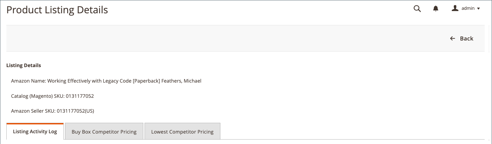

# Ver detalles de listado

La variable _[!UICONTROL Product Listing Details]_muestra información adicional sobre las listas de productos activas, incluido el registro de actividades de lista que muestra los cambios en un SKU o producto individual. Esta información puede ayudarle a comprender las métricas competitivas de sus productos y los cambios individuales en SKU o productos. La información adicional de esta página incluye:

- **[!UICONTROL Listing Details]** - Detalles del producto, incluidos el SKU de nombre y de vendedor de Amazon
- **[!UICONTROL Listing Activity Log]** - Registro histórico de todos los cambios que se han producido en este listado, como los cambios de precios y cantidad/stock. No es necesario realizar más acciones. Este registro se proporciona para su revisión a fin de comprender el historial de cambios.
- **[!UICONTROL Buy Box Competitor Pricing]** - Datos para Amazon [[!DNL Buy Box]](./buy-box-competitor-pricing.md) precios del estado y de la competencia
- **[!UICONTROL Lowest Competitor Pricing]** - Información sobre los precios y los comentarios más bajos del competidor de Amazon

Las páginas de inicio del canal de ventas de Amazon comparten algunas [controles del espacio de trabajo](./workspace-controls.md) que permiten personalizar los datos que se muestran.

## Detalles de la lista

La información del producto mostrada incluye:

- _[!UICONTROL Amazon Name]_
- _[!UICONTROL Catalog (Magento) SKU]_
- _[!UICONTROL Amazon Seller SKU]_

## Registro de actividades de lista {#listing-activity-log}

Muestra toda la actividad reciente de la lista de Amazon. La información mostrada incluye:

- SKU del vendedor de Amazon: Identifica la unidad de almacenamiento (SKU) definida para la lista.
- ASIN: Identifica el identificador de producto de Amazon de 10 dígitos.
- Acción de lista: Identifica el tipo de acción que se produjo para la lista.
- Comentarios: Proporciona detalles adicionales relacionados con el tipo de acción de listado que se produjo.
- Ejecutado en: Identifica la fecha y la hora en que se produjo la acción.

__

## Precio de la competencia del Buy Box {#buy-box-competitor-pricing}

Esta pestaña muestra información sobre el comerciante de Amazon que posee la variable [[!DNL Buy Box]](./buy-box-competitor-pricing.md) posición de la lista. Esta información se puede utilizar para comprender el posicionamiento de precios de sus competidores en Amazon. La información mostrada incluye:

- ASIN: Identificador de producto de Amazon de 10 dígitos.
- Es vendedor: Identifica si usted es el [!DNL Buy Box] vendedor. Opciones Sí / No.
- Condición: Identifica la condición definida para la lista.
- Precio de anuncio: Identifica el precio al que se publicó el anuncio.
- Precio de envío: Identifica el precio de envío añadido a la lista.
- Precio de destino: Identifica el precio del anuncio más el precio de envío del anuncio.
- Última actualización: Identifica la fecha y la hora en que se actualizó la información de precios desde Amazon.

## Precios de la competencia más bajos {#lowest-competitor-pricing}

Esta pestaña muestra información sobre los competidores de Amazon para la misma lista. Esta información se puede utilizar para comprender el posicionamiento de precios y [precio más bajo para el competidor](./lowest-competitor-pricing.md). La información mostrada incluye:

- ASIN: Identificador de producto de Amazon de 10 dígitos.
- Condición: Identifica la condición definida para la lista.
- Canal de cumplimiento: Identifica a la parte responsable del cumplimiento. Opciones: Comerciante/Amazon.
- Precio de anuncio: Identifica el precio al que se publicó el anuncio.
- Precio de envío: Identifica el precio de envío añadido a la lista.
- Precio de destino: Identifica el precio del anuncio más el precio de envío del anuncio.
- Clasificación de comentarios: Identifica la clasificación de comentarios de Amazon para el comerciante de menor precio.
- Recuento de comentarios: Identifica el recuento de comentarios de Amazon para el comerciante de menor precio.
- Última actualización: Identifica la fecha y la hora en que se actualizó la información de precios desde Amazon.

