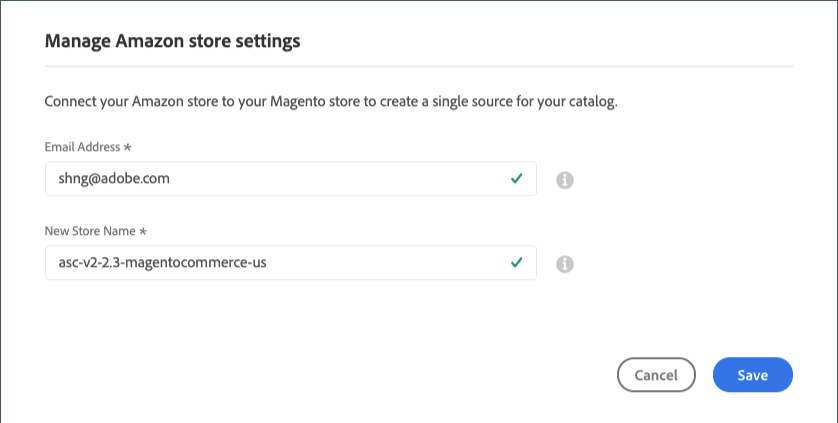

# Configuración de integración de almacén

Después de integrar su tienda, revise y configure la configuración de integración de la tienda a través del panel [!UICONTROL Amazon Store]. Esta configuración se muestra para las tiendas *Inactivas* y *Active*. Aquí puede cambiar el nombre de su tienda de Amazon y la dirección de correo electrónico que asoció con la tienda durante la integración de la tienda.

## Modificación de la configuración de integración del almacén

1. Para mostrar el [tablero](./amazon-store-dashboard.md) de la tienda, haga clic en **[!UICONTROL View Store]** en una tarjeta de la tienda.

1. Haga clic **[!UICONTROL Store Integration Settings]** en el menú de la izquierda.

1. Para **[!UICONTROL Email Address]**, actualice su dirección de correo electrónico de contacto preferida.

1. Para **[!UICONTROL New Store Name]**, actualice el nombre descriptivo del nuevo almacén de canales de ventas de Amazon.

   Este nombre aparece en la pestaña [_[!UICONTROL Amazon Stores]_](./managing-stores.md).

   Solo se utiliza como referencia de [!DNL Commerce] e identifica el almacén en la lista de la página principal del canal de ventas de Amazon. Debería ser algo que su equipo pueda identificar fácilmente. Por ejemplo, la tienda de Amazon que vende en la región de Estados Unidos puede tener el nombre `Amazon Store USA`.

1. Haga clic en **[!UICONTROL Save]**.

>[!NOTE]
>
>La configuración _[!UICONTROL Amazon Marketplace Country]_definida durante [integración del almacén](./store-integration.md) no se puede actualizar. Para editar la configuración del país, debe eliminar la tienda (en_[!UICONTROL Action]_ en la tarjeta de la tienda) y agregar una tienda para los diferentes países.

