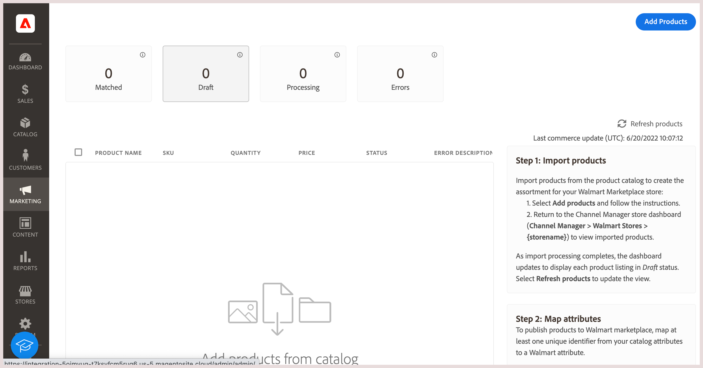
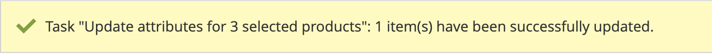

# Añadir productos a un canal conectado

Para sincronizar los productos con el canal de ventas de Walmart Marketplace, seleccione los productos del [!DNL Commerce] catálogo de productos e impórtelos en Channel Manager. Los productos seleccionados deben tener la siguiente configuración de atributos:

- **[!UICONTROL Publish to Channel Manager]** el atributo está habilitado

- Al menos un atributo de producto debe coincidir con uno de los [atributos requeridos de Walmart Marketplace](map-product-attributes-for-matching.md)-GTIN, ISBN, ISSN, UPC, EAN

El proceso de importación de productos de [!DNL Commerce] a Administrador de canales puede tardar hasta 30 minutos o más en función de la cantidad de productos que seleccione.

## Agregar productos al canal de ventas

1. En un almacén de canales de ventas conectado, seleccione **Agregar productos** para abrir el catálogo de productos.

   

   El catálogo se abre en una nueva pestaña.

1. En la cuadrícula de producto del catálogo, seleccione los productos que desea vender [!DNL Walmart Marketplace].

   

1. Active la variable **[!UICONTROL Publish to Channel Manager]** para los elementos seleccionados.

   - De **[!UICONTROL Actions]**, seleccione **[!UICONTROL Update attributes]**.

   - Desplácese hasta el **[!UICONTROL Publish to Channel Manager]** y actívelo.

   - Compruebe que los atributos de producto incluyen al menos uno de los ID de producto Walmart necesarios.

   - Select **[!UICONTROL Save]**.

   Aparece un mensaje de confirmación.

   

   Si el mensaje indica que la actualización está programada, utilice la variable [cola:consumers:start](https://devdocs.magento.com/guides/v2.4/config-guide/cli/config-cli-subcommands-queue.html) [!DNL CLI] para procesar la actualización inmediatamente.

   ```bash
   $ bin/magento queue:consumers:start product_action_attribute.update
   ```

1. Vuelva al canal de ventas conectado en [!DNL Channel Manager].

1. Una vez finalizada la operación de importación, consulte los productos desde **[!UICONTROL Listings]**.

   

   Inicialmente, los productos están en *Borrador* estado. Select **[!UICONTROL Refresh products]** para actualizar la tabla.

