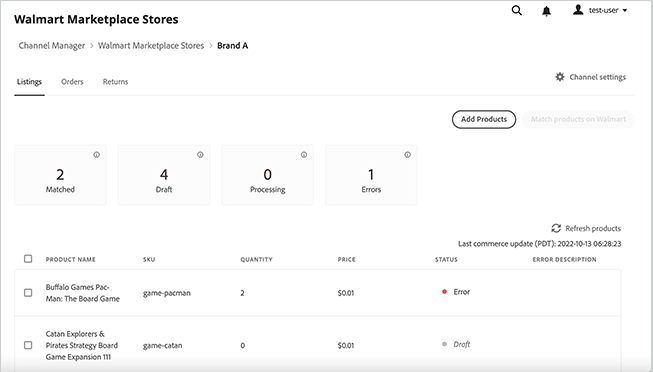

# Administrar anuncios

Administrar listas de productos para [!DNL Walmart Marketplace] canal de ventas desde la interfaz de usuario del administrador de canales.

El estado de una lista individual indica dónde se encuentra el producto en la [!DNL Channel Manager] flujo de trabajo para que pueda determinar los pasos siguientes y resolver los errores.

Puede completar las siguientes tareas desde la vista Listing .

* Ver anuncios actuales
* Ordenar y filtrar los anuncios
* Agregar productos
* Hacer coincidir productos
* Seguimiento del estado de la lista
* Revisar la descripción del error para los listados con un estado de error

## Ver listados de productos

1. Desde el administrador, vaya a [!UICONTROL **Marketing** > **Administrador de canales**].

1. En la lista Tienda, seleccione el icono de ojo en una fila de entrada de tienda para abrir la vista de tienda.

1. Select [!UICONTROL **Listados**].

1. Ordenar el *Listing* para ver, seleccione cualquier encabezado de columna en la *Listing* tabla.

1. Filtre el *Listing* seleccione una de las tarjetas de recuento de estado.

1. Restablecer el orden y quitar filtros seleccionando **Actualizar productos**.

## Agregar [!DNL Commerce] productos a Channel Manager

Cree el surtido de productos para el [!DNL Walmart Marketplace] completando las siguientes tareas:

* [Agregue productos de su [!DNL Commerce] catálogo de productos a [!DNL Channel Manager]](add-products-to-channel-store.md)

* [Asignar atributos de catálogo](map-catalog-attributes.md#configure-product-attribute-settings)

## Hacer coincidir productos [!DNL Walmart]

Puede crear ofertas de productos en la [!DNL Walmart Marketplace] mediante la coincidencia de productos o cargando manualmente listas de productos para nuevos productos.

* **[Hacer coincidir productos en Walmart](connect-listings-to-marketplace.md)**: conecte las listas de productos del canal a [!DNL Walmart Marketplace] actualizando los listados existentes que venden el mismo producto. Los criterios de coincidencia están determinados por la variable [configuración de asignación de atributos](map-catalog-attributes.md) para su canal.

* **[Cargar manualmente nuevos anuncios](connect-listings-to-marketplace.md#upload-new-product-listings)**: para productos que no coinciden con un listado existente en [!DNL Walmart Marketplace], utilice un [!DNL Walmart] categoría de producto Plantilla de Excel para cargar listas de productos de forma masiva.

## Listing Controls y descripciones de columnas

Las tablas siguientes describen los controles y las columnas disponibles para [!UICONTROL Listings].

**Controles para[!UICONTROL Listings]**

| **Control** | **Descripción** |
|----------------------------------------|--------------------------------------------------------------------------------------------------------------------------------------------------------------------------------------------------------------|
| [!UICONTROL Add Products] | Abre el [!UICONTROL Admin Product Catalog] página para seleccionar los productos que desea agregar al [!DNL Walmart Marketplace] o actualizar los atributos del producto para cumplir los requisitos de listado de Walmart Marketplace. |
| [!UICONTROL Match products on Walmart] | Después de seleccionar uno o varios productos en estado de borrador, seleccione Coincidir productos en [!DNL Walmart] para comprobar las ofertas de productos que se pueden agregar a una [!DNL Walmart Marketplace] listado. |
| [!UICONTROL Refresh products] | Actualice la visualización con el listado y el estado más actuales. Este control también restablece la vista de listado al orden de clasificación predeterminado y elimina los filtros. |
| [!UICONTROL Filter by *Estado*] | Mostrar solo los listados con un estado específico seleccionando una de las tarjetas de recuento de estado encima de la tabla Listing. Utilice la variable *Actualizar productos* para quitar el filtro. |
| [!UICONTROL Sort products] | Cambie el orden de clasificación seleccionando cualquier encabezado de columna. |

**Descripciones de columnas**

| **Campo** | **Descripción** |
|--------------------------------|-------------------------------------------------------------------------------------------------------------------------------------------------------------------------------------------------------------------------------------------------------------------------------------------------------------------------------------------------------------------|
| [!UICONTROL Product name] | Nombre del producto de la variable [!DNL Commerce] catálogo de tiendas. |
| [!UICONTROL SKU (Unique ID)] | El SKU asignado al producto en la variable [!DNL Commerce] catálogo. |
| [!UICONTROL  Quantity] | Cantidad de inventario disponible en Adobe Commerce o Magento Open Source. |
| [!UICONTROL Price] | El precio del producto de la variable [!DNL Commerce] catálogo de tiendas. Las actualizaciones de precios del catálogo se sincronizan con el Administrador de canales y, a continuación, se envían a [!DNL Walmart Marketplace]  para que los artículos mostrados muestren el precio actual. |
| [!UICONTROL Status] | Indica el estado del pedido actual en la variable [!DNL Commerce] flujo de trabajo de pedido. El estado se actualiza cuando se agregan productos correctamente a [!DNL Channel Manager] y cuando empareja productos en el mercado. Si una operación falla, la lista muestra un estado de error. Después de corregir el error, [!DNL Channel Manager] reintenta la operación y actualiza el estado. |
| [!UICONTROL Error Description] | Proporciona información de error adicional para los productos con una `[!DNL Error]` estado. |
| [!UICONTROL Status Detail] | Proporciona información adicional para los productos con *Error* o *Coincidencia* estado. |

### Acerca del estado de la lista

En el espacio de trabajo Listing , la etiqueta Status muestra dónde se encuentra un producto en la variable [!DNL Channel Manager] flujo de trabajo para que pueda determinar los pasos siguientes y resolver errores. Los anuncios pueden tener las siguientes etiquetas de estado:

* **[!UICONTROL Draft]**-Identifica productos que no se han [enviado a [!DNL Walmart] para coincidencia](connect-listings-to-marketplace.md#match-products).

* **[!UICONTROL Processing]**: identifica los productos enviados para coincidir en el [!DNL Walmart Marketplace]. Los productos permanecen en *Procesamiento* hasta que [!DNL Walmart] devuelve un mensaje de estado HTTP que indica si la coincidencia se ha realizado correctamente o si se ha producido un error. La operación de coincidencia puede tardar hasta 30 minutos en completarse en el [!DNL Walmart Marketplace].

* **[!UICONTROL Match]**-Identifica los productos con los que se ha alcanzado una coincidencia satisfactoria en [!DNL Walmart].

   Se produce una coincidencia cuando el valor del atributo del producto (por ejemplo, el código UPC) coincide con el valor UPC de una [!DNL Walmart Marketplace] listado. Cuando un producto coincide, la oferta de producto de Comercio se agrega a la lista existente.

   Marque la [[!UICONTROL Walmart Marketplace Seller Account Items]](https://seller.walmart.com/items-and-inventory/manage-items) tablero para revisar la lista de productos actualizada y verificar los detalles del producto, el precio y la cantidad de inventario.

* **[!UICONTROL Match - Match in Stage]**—Identifica los productos coincidentes en [!DNL Walmart] que no se pueden conectar hasta que el [!DNL Walmart Marketplace] la tienda está activa. Los productos con este estado se conectan automáticamente cuando la variable [!DNL Walmart Marketplace] la tienda se pone en marcha.

* **[!UICONTROL Error]**: identifica los productos que no coinciden con una [!DNL Walmart Marketplace] listado.

* **[!UICONTROL Error description]**: proporciona información detallada sobre el error de listado.

   Después de resolver el error, vuelva a enviar el producto para que coincida. Consulte [Solución de problemas de errores de coincidencia de productos](connect-listings-to-marketplace.md#troubleshoot-product-match-errors).
