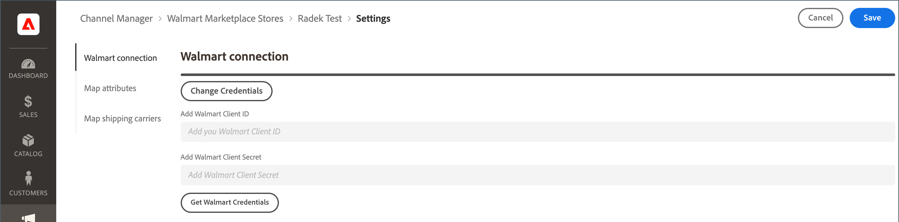

# Asignar transportistas de envío

Antes de [procesar envíos de pedidos](process-orders.md#ship-an-order) para [!DNL Walmart Marketplace] pedidos, asigne los transportistas preferidos de Walmart a los transportistas correspondientes en [!DNL Commerce] para que los datos de envío se puedan sincronizar entre [!DNL Walmart] y [!DNL Commerce].

Los operadores de comercio que no se asignan a un operador preferido están etiquetados como *[!UICONTROL Other Carrier]* en [!DNL Walmart].

**Requisitos previos**

Consulte [Requisitos de Walmart](walmart-requirements.md) para el [!DNL Marketplace Seller account].

## Actualizar credenciales de conexión

1. En el [!UICONTROL Listings] para el almacén de canales de ventas, seleccione **[!UICONTROL Channel Settings]**.

1. Activado **[!UICONTROL Channel Settings]**, seleccione **[!UICONTROL Walmart Connection]**.

1. Para modificar las credenciales, seleccione **[!UICONTROL Change Credentials]**

   

1. Introduzca la variable **[!UICONTROL Walmart Client ID]** y **[!UICONTROL Walmart Client Secret]**.

1. Select **[!UICONTROL Save]** para aplicar la configuración.
